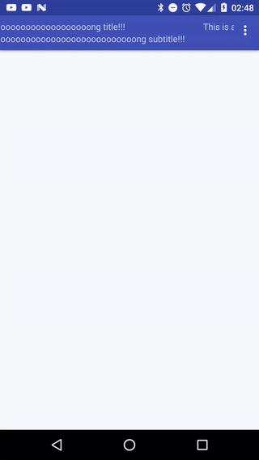

# Android Marqueeable Toolbar

```groovy
compile "org.mightyfrog.marqueetoolbar:marqueetoolbar:1.0.0"
``` 

Usage
--------
Replace android's <i>Toolbar</i> with <i>org.mightyfrog.widget.MarqueeToolbar</i>.
```xml
<?xml version="1.0" encoding="utf-8"?>
<android.support.design.widget.CoordinatorLayout
    xmlns:app="http://schemas.android.com/apk/res-auto"
    android:layout_width="match_parent"
    android:layout_height="match_parent"
    android:fitsSystemWindows="true">

    <android.support.design.widget.AppBarLayout
        android:layout_width="match_parent"
        android:layout_height="wrap_content"
        android:theme="@style/AppTheme.AppBarOverlay">

        <org.mightyfrog.widget.MarqueeToolbar
            android:id="@+id/toolbar"
            android:layout_width="match_parent"
            android:layout_height="?attr/actionBarSize"
            android:background="?attr/colorPrimary"
            app:popupTheme="@style/AppTheme.PopupOverlay"
            app:subtitleMarqueeEnabled="true"
            app:subtitleText="@string/test_subtitle"
            app:titleMarqueeEnabled="true"
            app:titleText="@string/test_title" />

    </android.support.design.widget.AppBarLayout>

</android.support.design.widget.CoordinatorLayout>
```

**XML attributes**
<br>
<b>startDelay</b>: the start delay in ms (default = 0)
<br>
<b>titleRepeat</b>: the number of title loops, -1 to repeat permanently (default = -1)
<br>
<b>mRepeatSubtitle</b>: the number of subtitle loops, -1 tp repeast permanently (default = -1)
<br>
<b>mTitleMarqueeEnabled</b>: enable(true)/disable(false) title marque (defualt = true)
<br>
<b>subtitleRepeat</b>: enable(true)/disable(false) subtitle marque (defualt = true)
<br>
<b>titleText</b>: the default title text
<br>
<b>subtitleText</b>: the default subtitle text

[](https://travis-ci.org/mightyfrog/marqueetoolbar)
